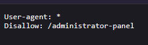

# Unprotected admin functionality

**Category:** Web Exploitation — Access control
**Difficulty:** Apprentice
**Progress:** Solved

---

## Description

**Lab URL:** `https://portswigger.net/web-security/access-control/lab-unprotected-admin-functionality`

This lab has an unprotected admin panel.

Solve the lab by deleting the user carlos. 

---

## Reconnaissance

- What does the application do? 
    - The website is a shop with an account functionality. Users can look at the details of items on the homepage.
- Where is user input accepted? (forms, URL parameters, headers, cookies)
    - User input is allowed for the login page and potentially the url
- What happens with normal input?
    - Unable to say for now, normal input for the login functionality should just login the user

---

## Analysis


#### Vulnerability

The admin panel is not protected. It is just hidden as path in the url that is freely accessible.

---

## Solution 

### Step 1 - Recon / Looking at responses

First idea to find the admin panel is to simply append it to the url:
```
https://0a6900f80313913f80275d74003500f3.web-security-academy.net/admin
```
but this results in nothing.
Maybe there is a "robots.txt"?
And indeed there is:

So the admin panel is hidden at `administrator-panel`
If the correct path was not shown in the "robots.txt" burp intruder or tools like DirBuster could have helped to bruteforce the paths.

---

### Step 2 - Enumeration / Step 3 - Exploit

After accessing `https://0a6900f80313913f80275d74003500f3.web-security-academy.net/administrator-panel` and deleting the user carlos the lab is solved.

---
## Real World Impact

This vulnerability allows attackers to freely access the admin panel so he can (in this case) delete any user in the system. In reality admins have a lot more privileges and often can change the website layout and content as well as useraccounts. This means they could potentially forward users to their own hacked website and cause further damages. Of course they could also get access to password hashes connected to user accounts and try to break them offline.
The correct way to protect this endpoint would be to check if the user accessing is a logged-in (authentication) and is an admin (authorization) - the later point being the important one here.


---
## Learnings

- the admin panel path was supposed to be secret - putting it into robots.txt is exactly the opposite of that
- hiding an endpoint like that is "security through obscurity". Even if the endpoint was named something random bruteforcing is not a hard thing to do.

