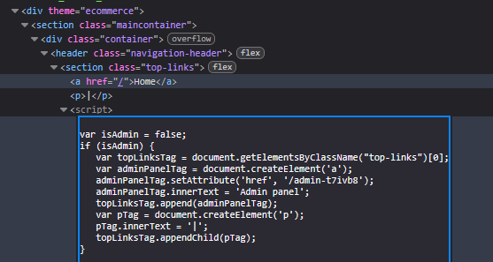

# Unprotected admin functionality with unpredictable URL

**Category:** Web Exploitation — Access control
**Difficulty:** Apprentice
**Progress:** Solved

---

## Description

**Lab URL:** `https://portswigger.net/web-security/access-control/lab-unprotected-admin-functionality-with-unpredictable-url`

This lab has an unprotected admin panel. It's located at an unpredictable location, but the location is disclosed somewhere in the application.

Solve the lab by accessing the admin panel, and using it to delete the user carlos. 

---

## Reconnaissance

- What does the application do? 
    - The website is a shop with an account functionality. Users can look at the details of items on the homepage.
- Where is user input accepted? (forms, URL parameters, headers, cookies)
    - User input is allowed for the login page and potentially the url
- What happens with normal input?
    - Unable to say for now, normal input for the login functionality should just login the user

---

## Analysis

#### Vulnerability

The admin panel is still accessible by any visitor of the site and not protected against unauthorized access.
The website leaked the correct path to it in its own code.

---

## Solution 

### Step 1 - Recon / Looking at responses

This time there is not "robots.txt".
Deep inside the html code the correct path is hidden though:

---

### Step 2 - Enumeration / Step 3 - Exploit

After accessing `https://0ae100440486a25880a6762800290033.web-security-academy.net/admin-t7ivb8` deleting carlos solves the lab.

---
## Real World Impact

Same impact as last lab, the admin lab was still accessible by non-admins and its protection relied on trusting the client side. The Admin-check should be server side though.

---
## Learnings

- The website code checks if the user is admin but it does so on client side which is not reliable. NEVER trust the client
