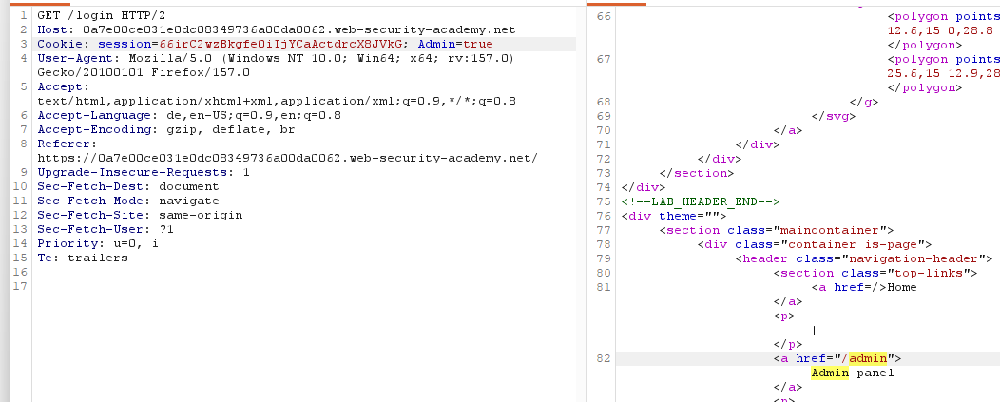

# User role controlled by request parameter

**Category:** Web Exploitation — Access control
**Difficulty:** Apprentice
**Progress:** Solved

---

## Description

**Lab URL:** `https://portswigger.net/web-security/access-control/lab-user-role-controlled-by-request-parameter`

This lab has an admin panel at /admin, which identifies administrators using a forgeable cookie.
Solve the lab by accessing the admin panel and using it to delete the user carlos.
You can log in to your own account using the following credentials: wiener:peter 

---

## Reconnaissance

- What does the application do? 
    - The website is a shop with an account functionality. Users can look at the details of items on the homepage.
- Where is user input accepted? (forms, URL parameters, headers, cookies)
    - User input is allowed for the login page and potentially the url
- What happens with normal input?
    - Unable to say for now, normal input for the login functionality should just login the user

---

## Analysis

#### Vulnerability

The vulnerability is again trusting client side information. In this case the cookie that is used to determine if a user has admin-access.

---

## Solution 

### Step 1 - Recon / Looking at responses

This time there is an admin panel at `/admin` but it is only available to users logged in as an administrator. The question is: how does the system determine that the user is an administrator. The lab mentions the cookie. Going straight to the admin panel does not show anything of interest in the request or response.
After logging in there is a GET-request url ending with `/my-account?id=wiener` changing this to `id=dmin` or `id=administrator` does not work.
When looking at all these requests and responses one thing sticks out `Admin=false` is written in every the requests.  
That means the client can again change the parameter that is used for verification. The first request that uses `Admin=false` is the very first get request before logging in.
When finally logging in as `wiener` the response to our login request includes `Set-Cookie: Admin=false`

---

### Step 2 - Enumeration / Step 3 - Exploit

Everything we found out so far indicates, that we are allowed to set `Admin=true` and access the panel that way maybe.
The request to look at in this case is the GET-request before the actual login.

This means in the browser we can login and then change the admin cookie to true in the webtools and reload the page to get access to the admin panel. 
Now deleting carlos solves the lab.

An alternative solution would have been to just use the interceptor and set admin to true there - this would also result in access to the admin panel.

---
## Real World Impact

This vulnerability lets an attacker with an existing user account get admin access. That way he can delete, create and change user accounts or even change the website and its behaviour to do something malicious.

---
## Learnings

- scan every client controlled variable (cookies, parameters, hidden fields, JWT) for values that confirm the users role/privilege. If the server trusts client information it is in danger
