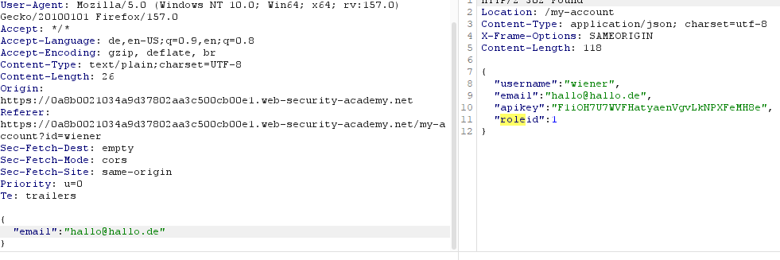

# User role can be modified in user profile

**Category:** Web Exploitation — Access control
**Difficulty:** Apprentice
**Progress:** Solved

---

## Description

**Lab URL:** `https://portswigger.net/web-security/access-control/lab-user-role-can-be-modified-in-user-profile`

This lab has an admin panel at /admin. It's only accessible to logged-in users with a roleid of 2.
Solve the lab by accessing the admin panel and using it to delete the user carlos.
You can log in to your own account using the following credentials: wiener:peter 

---

## Reconnaissance

- What does the application do? 
    - The website is a shop with an account functionality. Users can look at the details of items on the homepage.
- Where is user input accepted? (forms, URL parameters, headers, cookies)
    - User input is allowed for the login page and potentially the url
- What happens with normal input?
    - Unable to say for now, normal input for the login functionality should just login the user

---

## Analysis


#### Vulnerability

There is a mass assignment/auto-binding vulnerability here. When the user actually changes the email the server takes all the fields provided in the request body and processes it in the backend. In this case the `roleID` will be set to 1 if there is none given. But the client is still allowed to give another role id and thus get privileged access due to the server not verifying that information.


---

## Solution 

### Step 1 - Recon / Looking at responses

Loggin in, trying `id=admin` and looking at the requests and responses looks normal at first. 
The lab specifically mentions that the user can modify their own role, so I looked through all responses looking for `roleid` and did not find a single instance.
Then I got an idea to change my email since this is the only thing the user is allowed to change.
And there it is:


The response includes `roleid`.

```
---

### Step 2 - Enumeration / Step 3 - Exploit

Now I can just insert `roleid` into my own dictionary in the request:
```
{
    "email":"hallo@hallo.de",
    "roleid":2
}
And voilà, access to the admin panel. Deleting carlos account solves the lab.

---
## Real World Impact

The danger of this vulnerability is not limited to `roleid`. The backend binds every field of the request. This means an attacker can bind any field that the object holds and freely change it. This includes fields not shown in the form and even unknown fields. This can potentially also be used to bypass email verifiaction, setting balances in an account or bypassing premium features. 

---
## Learnings

- don't only look at the requests, in some cases the responses hold the valuable info which can be manipulated with carefully crafted requests.