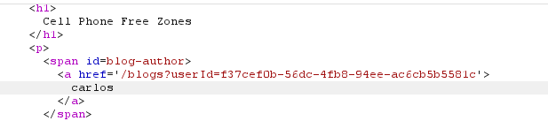

# User ID controlled by request parameter, with unpredictable user IDs

**Category:** Web Exploitation — Access control
**Difficulty:** Apprentice
**Progress:** Solved

---

## Description

**Lab URL:** `https://portswigger.net/web-security/access-control/lab-user-id-controlled-by-request-parameter-with-unpredictable-user-ids`

This lab has a horizontal privilege escalation vulnerability on the user account page, but identifies users with GUIDs.
To solve the lab, find the GUID for carlos, then submit his API key as the solution.
You can log in to your own account using the following credentials: wiener:peter 

---

## Reconnaissance

- What does the application do? 
    - The website is a shop with an account functionality. Users can look at the details of items on the homepage.
- Where is user input accepted? (forms, URL parameters, headers, cookies)
    - User input is allowed for the login page and potentially the url
- What happens with normal input?
    - Unable to say for now, normal input for the login functionality should just login the user

---

## Analysis

#### Vulnerability

This is a classic Insecure Direct Object Reference (IDOR) vulnerability. The server is not verifing if a user is authorized to access that specific user record.

---

## Solution 

### Step 1 - Recon / Looking at responses

First step is to login again. This time the parameter in the url looks good: `https://0a5800400302d03c809a586c001b002c.web-security-academy.net/my-account?id=65bb2c0b-8dd3-4813-80c9-29dedaa8265c` atleast `65bb2c0b-8dd3-4813-80c9-29dedaa8265` is not easy to guess. But it looks like some kind of hex value?
Converting it does nothing though, so it might just be a huge hex value or rather multiple hex values. Converting the API and Username and password to hex also shows nothing close to it, so the value seems to be random. Then I went through the blog entries and postet a comment, looking at the response if there is a userid somewhere. And indeed there is, just not for the comment but for the posting account.

---

### Step 2 - Enumeration / Step 3 - Exploit

Carlos did indeed create a blog about "Cell Phone Free Zones". 

So his id seems to be: `f37cef0b-56dc-4fb8-94ee-ac6cb5b5581c`
And thus his API-key is `4X0KB3mEF44LtBOnQZieLvTQzAGyzpoG` which after submitting it, solves the lab.

---
## Real World Impact

This time the userid was not guessable, which slightly better. It could still be bruteforced which is not even needed here. It is leaked everytime a user posts a blog, which means every account that evey posted an entry is in danger here. The website still does not do a server-side check if a logged in user is authorized to access certain records.

---
## Learnings

- leaks for request-parameters do not need to be in the request itself, they can be anywhere on the site - usually where users interact though.