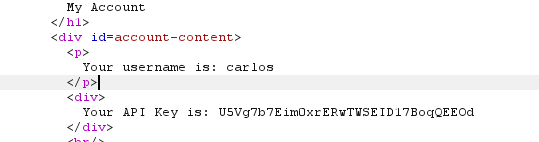

# User ID controlled by request parameter with data leakage in redirect

**Category:** Web Exploitation — Access control
**Difficulty:** Apprentice
**Progress:** Solved

---

## Description

**Lab URL:** `https://portswigger.net/web-security/access-control/lab-user-id-controlled-by-request-parameter-with-data-leakage-in-redirect`

This lab contains an access control vulnerability where sensitive information is leaked in the body of a redirect response.
To solve the lab, obtain the API key for the user carlos and submit it as the solution.
You can log in to your own account using the following credentials: wiener:peter 

---

## Reconnaissance

- What does the application do? 
    - The website is a shop with an account functionality. Users can look at the details of items on the homepage.
- Where is user input accepted? (forms, URL parameters, headers, cookies)
    - User input is allowed for the login page and potentially the url
- What happens with normal input?
    - Unable to say for now, normal input for the login functionality should just login the user

---

## Analysis

#### Vulnerability

Information leak in a redirect. The access control worked - but too late. If it worked correctly it would stop the server from even generating that sensitive information and nothing could get leaked.

---

## Solution 

### Step 1 - Recon / Looking at responses

Logging in as wiener is the same as always. But we are back at `id=wiener` in the url. 
Trying to change that id to carlos returns us to a login page.

---

### Step 2 - Enumeration / Step 3 - Exploit

Looking at the requests in burp shows that the response to trying to access `id=carlos` also leaks his API key:

So his API-key is: `U5Vg7b7Eim0xrERwTWSEID17BoqQEEOd` which after submition, solves the lab.

---
## Real World Impact

This vulnerability shows that the moment important values like ids are used in the frontend it becomes dangerous and one should act with caution. Leaks like this can be detrimental and compromise whole systems, causing massive damage. A block that is a redirect can still be serving data underneath and need to be checked. 

---
## Learnings

- even redirects can leak information - always go through all the requests and responses 1 by 1 if there is nothing sticking out