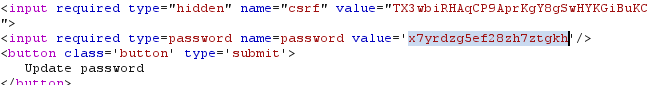
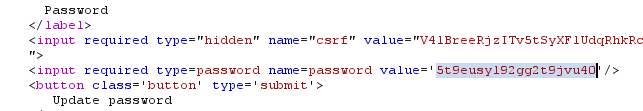

# User ID controlled by request parameter with password disclosure

**Category:** Web Exploitation — Access control
**Difficulty:** Apprentice
**Progress:** Solved

---

## Description

**Lab URL:** `https://portswigger.net/web-security/access-control/lab-user-id-controlled-by-request-parameter-with-password-disclosure`

This lab has user account page that contains the current user's existing password, prefilled in a masked input.
To solve the lab, retrieve the administrator's password, then use it to delete the user carlos.
You can log in to your own account using the following credentials: wiener:peter 

---

## Reconnaissance

- What does the application do? 
    - The website is a shop with an account functionality. Users can look at the details of items on the homepage.
- Where is user input accepted? (forms, URL parameters, headers, cookies)
    - User input is allowed for the login page and potentially the url
- What happens with normal input?
    - Unable to say for now, normal input for the login functionality should just login the user

---

## Analysis

#### Vulnerability

Masked password in the page is not masked in the html. This allows the attacker to instantly turn a horizontal privilege escalation into a vertical one (admin rights). 

---

## Solution 

### Step 1 - Recon / Looking at responses

This time after the login it is possible to update email and password.
It is also possible to change the url id to carlos and acess his account that way.
And looking at the response to this request (`/my-account/?id=carlos`) it is also possible to see his password:

Setting the id to `admin` did not work.

---

### Step 2 - Enumeration / Step 3 - Exploit

Setting the id to `administrator` worked though. So his password should be in the response as well:

So the admin password is: 5t9eusyl92gg2t9jvu40
Logging in as administrator allows us to delete carlos and solve the lab.

---
## Real World Impact

The way this works let the attacker instantly escalate into admin privileges letting the attacker change, create or delete accounts and modify the web page. Even though the IDOR vulnerability is fixed, it all does nothing if the password is leaked like that. A security chain is only as strong as its weakest link. A well built app wouldn't store a password in plaintext like that but rather as a salted (secure) hash (think of algorithms like script or Argon2)

---
## Learnings

- noMasked =/= hidden, client side masking is dangerous.