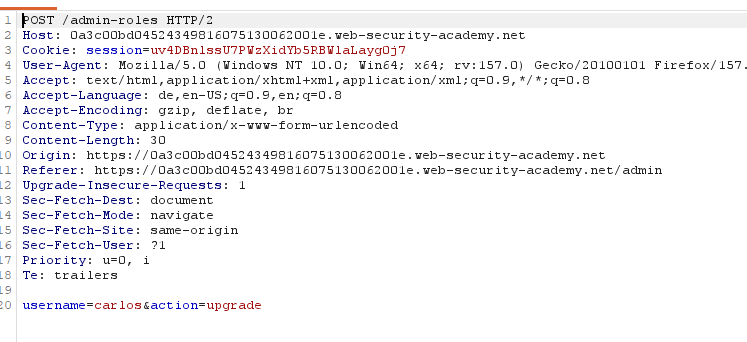
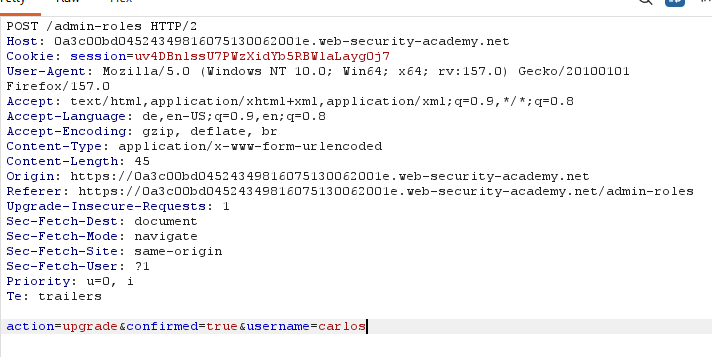
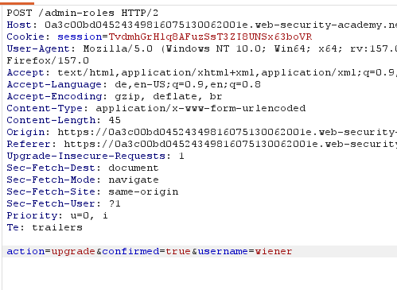

# Multi-step process with no access control on one step

**Category:** Web Exploitation — Access control
**Difficulty:** Apprentice
**Progress:** Solved

---

## Description

**Lab URL:** `https://portswigger.net/web-security/access-control/lab-multi-step-process-with-no-access-control-on-one-step`

This lab has an admin panel with a flawed multi-step process for changing a user's role. You can familiarize yourself with the admin panel by logging in using the credentials administrator:admin.

To solve the lab, log in using the credentials wiener:peter and exploit the flawed access controls to promote yourself to become an administrator. 

---

## Reconnaissance

- What does the application do? 
    - The website is a shop with an account functionality. Users can look at the details of items on the homepage.
- Where is user input accepted? (forms, URL parameters, headers, cookies)
    - User input is allowed for the login page and potentially the url
- What happens with normal input?
    - Unable to say for now, normal input for the login functionality should just login the user. 

---

## Analysis

#### Vulnerability

Here the vulnerabilty is that the second request that is used to change an accounts privileges is not secured while the first one is. This is likely due to the developer assuming that you can only reach step 2 if you managed to get through step 1 - which obviously is wrong as shown later. Any attacker that can replicate the second request is able to change any accounts permissions that way.

---

## Solution 

### Step 1 - Recon / Looking at responses

Changing roles as an admin works, whenever it is done we will be asked to verify we really want to change a users privileges.
As `wiener` we can not access `/admin` or `/admin-roles`.
To change a users privileges there are two post requests:

---

### Step 2 - Enumeration / Step 3 - Exploit

Judging by the lab one of these steps is not secured properly.
Properly the second request.
That means if we login as `wiener` and repeat the second request but with `wiener`s session cookie we could potentially change the privileges of our own account.
Doing exactly that:
 sets wieners privileges to admin and solves the lab.

---
## Real World Impact

This is detrimental mostly because it looks so secure, which means an attacker abusing this vulnerability might be undetected for a long time silently observing.
This is a classic vulnerability of only protecting the entry point and not the whole flow. This works against nomral users but attackers work on the request level so everything has to be locked down, not only the UI level

---
## Learnings

- If there are processes with multiple steps test them from last -> first, maybe one is not protected properly. 
- Don't assume a later step is secure because an earlier one is
