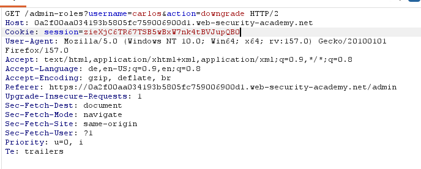
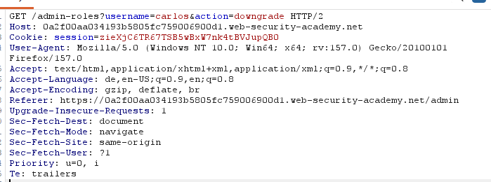

# Referer-based access control 
**Category:** Web Exploitation — Access control
**Difficulty:** Apprentice
**Progress:** Solved

---

## Description

**Lab URL:** `https://portswigger.net/web-security/access-control/lab-referer-based-access-control`

This lab controls access to certain admin functionality based on the Referer header. You can familiarize yourself with the admin panel by logging in using the credentials administrator:admin.

To solve the lab, log in using the credentials wiener:peter and exploit the flawed access controls to promote yourself to become an administrator. 

---

## Reconnaissance

- What does the application do? 
    - The website is a shop with an account functionality. Users can look at the details of items on the homepage.
- Where is user input accepted? (forms, URL parameters, headers, cookies)
    - User input is allowed for the login page and potentially the url
- What happens with normal input?
    - Unable to say for now, normal input for the login functionality should just login the user. 

---

## Analysis

#### Vulnerability

The role-change-endpoint authorizes based on the `Referer`-Header, so any user with the `Referer`-Header `.../admin` is treated as an admin.

---

## Solution 

### Step 1 - Recon / Looking at responses

Everything looks normal at first. Admin logs in, changes user accounts. So let's look at the request in burp.
As per the lab we take a close look at the `Referer`-Header.
When we navigate to the admin panel `Referer` is `https://0a2f00aa034193b5805fc759006900d1.web-security-academy.net/my-account?id=administrator` and then when actually changing the roles it is `https://0a2f00aa034193b5805fc759006900d1.web-security-academy.net/admin`
Apart from the login these are all GET-requests.

---

### Step 2 - Enumeration / Step 3 - Exploit

Exploiting this is straight forward. Looking at the actual request to change the roles:

The only things that need changing are `username=carlos` to `username=wiener`, `action=downgrade` to `action=upgrade`, the session cookie needs to be changed to the one of `wiener` who is logged in right now and of course the `Referer`-Header to `https://0a2f00aa034193b5805fc759006900d1.web-security-academy.net/admin`.
Should look like this:

And sending that request already solves the lab. We can confirm this since the admin panel is now part of the tools `wiener` has.

---
## Real World Impact

The `Referer`-header is entirely client side controlled and thus can not be trusted for security verifactions. Basing verification on it equals no verification vs an attacker.

---
## Learnings

- `Referer`-header is client controlled like (`Host`, `X-Forwarded-*` and `X-Original-URL`) and if used as a security control by a website is vulnerable. 