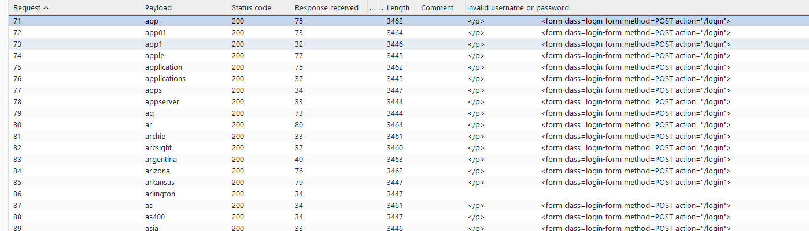
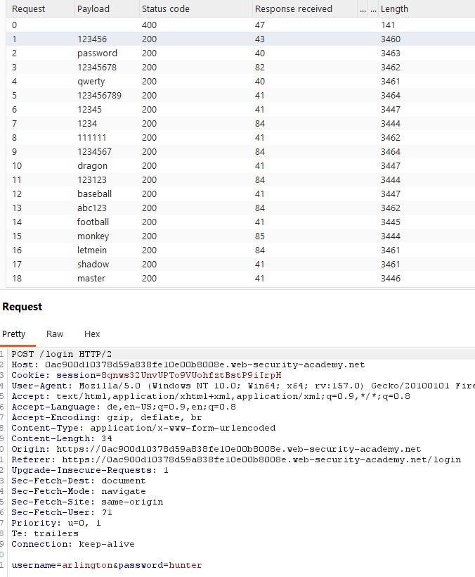

# Username enumeration via subtly different responses

**Category:** Web Exploitation — Authentication
**Difficulty:** Practitioner
**Progress:** Solved

---

## Description

**Lab URL:** `https://portswigger.net/web-security/authentication/password-based/lab-username-enumeration-via-subtly-different-responses`

This lab is subtly vulnerable to username enumeration and password brute-force attacks. It has an account with a predictable username and password, which can be found in the following wordlists:

- Candidate usernames
- Candidate passwords

To solve the lab, enumerate a valid username, brute-force this user's password, then access their account page.  

---

## Reconnaissance

- What does the application do? 
    - The website is a blog about several, seemingly to tech related topics. Users can read and leave comments under blog articles.
- Where is user input accepted? (forms, URL parameters, headers, cookies)
    - There is an account page with a login, the comments below articles can be consideres input too.
- What happens with normal input?
    - I assume normal login actually logs you in

---

## Analysis

#### Technology Stack

 - no cookie at all this time, not really identifiable. 

#### Vulnerability

- What exactly is vulnerable and why?
    
As per the lab instructions the username is vulnerable to enumeration and the password to brutefoce attacks.
As shown in step 1 and 2 this is true and bruteforce attacks find the correct login really quickly.

---

## Solution 

### Step 1 - Looking at responses

There is no url redirect on failed tries.
The only thing coming back on unsuccessful logins is a printed: `Invalid username or passwords`. This also shows in the http response in burp repeater. There is no difference in the response status code no matter what username is input. I guess the response changes if the inputted username is correct.

---

### Step 2 - Enumeration / Step 3 - Exploit

In this case I do not really see the point of guessing/enumerating a password when there is no real hint at it. So let's just use Burp Intruder and bruteforce it. Input the list of possible usernames proved.
Every response looks the same and had the same or nearly same length so nothing out of the ordinary here. But what this lab wants to teach is that even small differences in the response to a user can be an attack surface.
In this case for a totally wrong username the printed text is: `Invalid username or password.`. In the intruder there is a tool `Grep extract` and if that text is the one to be extracted there is one line that does not have it. That is our username. The problem here is that for the correct username the printed line differs. It is `Invalid username or password `. No dot but a space. And now iterating for the password is easy. Alternatively a cluster bomb attack works too but usually that takes longer (especially with bigger username spaces than the one provided).

In this case the username is "arlington"

The bruteforce for the password is now easy. For the correct password there should be a different response again:

One login later the lab is done.
One thing to note is that emails are apparently in the format `arlington@normal-user.net`. Maybe this comes in handy in later labs.

---
## Real World Impact

This lab reminds me of some sqli labs. Even the smalles misconfiguration is enough to make the attackers job way easier. 
This could have been avoided by simply copy pasting the html response.

---
## Learnings

- response length can be a quick indicator for something being fishy, but it does not have to be