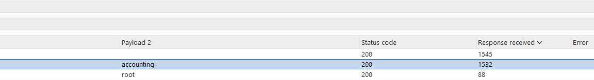
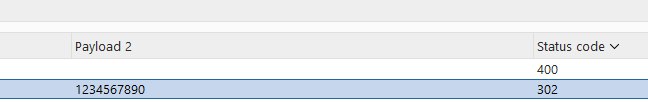

# Username enumeration via response timing

**Category:** Web Exploitation — Authentication
**Difficulty:** Practitioner
**Progress:** Solved

---

## Description

**Lab URL:** `https://portswigger.net/web-security/authentication/password-based/lab-username-enumeration-via-response-timing`


This lab is vulnerable to username enumeration using its response times. To solve the lab, enumerate a valid username, brute-force this user's password, then access their account page.

- Your credentials: wiener:peter
- Candidate usernames
- Candidate passwords

Hint:
To add to the challenge, the lab also implements a form of IP-based brute-force protection. However, this can be easily bypassed by manipulating HTTP request headers. 

---

## Reconnaissance

- What does the application do? 
    - The website is a blog about several, seemingly to tech related topics. Users can read and leave comments under blog articles.
- Where is user input accepted? (forms, URL parameters, headers, cookies)
    - There is an account page with a login, the comments below articles can be consideres input too.
- What happens with normal input?
    - I assume normal login actually logs you in

---

## Analysis


#### Vulnerability

- What exactly is vulnerable and why?
    
As per the lab instructions the username is vulnerable to enumeration and the password to brutefoce attacks. All of it is based on response timing

---

## Solution 

### Step 1 - Recon / Looking at responses

Okay following the lab putting in 'wiener' and 'peter' as a password gives back a 302 http response. 
The lab mentions the brute-force protection can be bypassed by manipulating the HTTP request headers.
The `X-Forwarded-For` header can be abused to do that. Usually it is used so that the backend server knows the clients IP even if there is a proxy between them.
But since there are no countermeasures in place to stop us from adding/editing it we can use it to bypass the brute-force protection.
Since `X-Forwarded-For` is use controlled it is easily forged.
It looks like this:
```
X-Forwarded-For: 100

```

Now sending `wiener` and `peter` in a POST request logs us in. If we change `peter` by multiplying it times 52 and thus create a long password and increase the `X-Forwarded-For` header by one, the response takes noticeable longer. Repeating this a couple of times confirms this is not a one off. This is because even though the user exists the password does not and hashing a password that long to verify takes longer than for the correct one or just any smaller password.


---

### Step 2 - Enumeration / Step 3 - Exploit

Now using Intruder, setting it to pitchfork attack, counting up the forwarded header and using the username to find the correct username while using a really long password.

And there is our username.


Now same thing for the password after setting the username to accounting. This time looking for that 302 response which stands for found.



One login later the lab is solved.

---
## Real World Impact

This is a first step on taking over a system. In this case we just had one account name, which is easy to find with OSINT (Linkedin Usernames are often enough). After cracking one account all the others can just be cracked the same way (as long as the usernames are known). If the passwords were not in a list they could still be bruteforced. In reality there would be other counter measures though, which makes this not as trivial as in the lab.

---
## Learnings

- Servers often only run 'expensive'/resource heavy operations like hashing passwords if the condition is true - in this case the username being correct is the condition. This is measurable for timing attacks
- Client-side headers can be used to trick the server
- Servers should not trust these headers and put mechanics in place to always respond in a similiar time