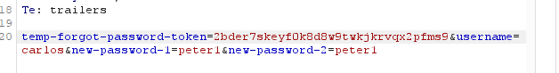

# Password reset broken logic

**Category:** Web Exploitation — Authentication
**Difficulty:** Apprentice
**Progress:** Solved

---

## Description

**Lab URL:** `https://portswigger.net/web-security/authentication/other-mechanisms/lab-brute-forcing-a-stay-logged-in-cookie`
 
This lab's password reset functionality is vulnerable. To solve the lab, reset Carlos's password then log in and access his "My account" page.

- Your credentials: wiener:peter
- Victim's username: carlos

---

## Reconnaissance

- What does the application do? 
    - The website is a blog about several, seemingly to tech related topics. Users can read and leave comments under blog articles.
- Where is user input accepted? (forms, URL parameters, headers, cookies)
    - There is an account page with a login, the comments below articles can be consideres input too.
- What happens with normal input?
    - Correct user logins log the user in normally, if setting the logged in checkbox it keeps the user logged in for next time

---

## Analysis

#### Vulnerability

The user verification when resetting a password is vulnerable. The token is sufficently random but is not checked properly when resetting a password.

---

## Solution 

### Step 1 - Recon / Looking at responses

First I will verify how the process to reset a password works. If I reset my password for 'wiener' my username is just send as data in the body of the POST-request. Then I am sent an email to the labs own email server with a link inside.
In my case that link looks like this: `https://0a11008a0492f0e282da74a2002c00fc.web-security-academy.net/forgot-password?temp-forgot-password-token=1cns8vns8krrb59gwf9gioqkomgz4d3i` 
The token that is added to this link to connect it to my account looks like the key here.
It is not base64 encoding of the accountname or password or a hash of some sorts.
Sending a new request for a password reset also returns a new token. This means it could be generated depending on the time. Only the newest token seems to be usable. The token is indeed also used in final POST-request body to verify the account. 
But that is interesting, changing the token in the final post request returns the same found response (the new token can even be different length) so it is not verified properly on the backend.

---

### Step 2 - Enumeration / Step 3 - Exploit

Because the backend does not verify the token properly it is possible to just ignore it entirely and change 'wiener' to 'carlos' and set any password we want.

Now logging in with the new password solves the lab.

---
## Real World Impact

This vulnerability not only gives an attacker the tools to login to accounts that don't belong to him. It also creates a way for the attacker to permanently lock account owners out of their own accounts. Resetting the password is the first step here. But with the new password an attacker can also just change all the settings inside the account, including the email adresses connected, removing any way for owners to get their account back in a resonable time frame.

---
## Learnings

- Always verify that defense mechanisms like tokens are actually used and not just for show.