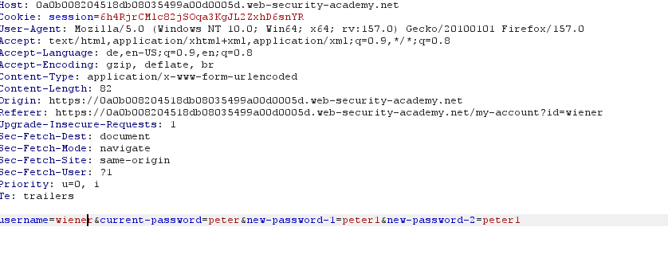
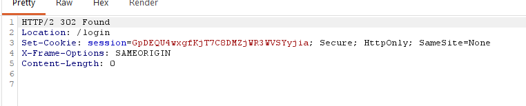
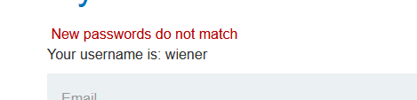
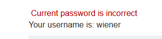

# Password brute-force via password change

**Category:** Web Exploitation — Authentication
**Difficulty:** Practicioner
**Progress:** Solved

---

## Description

**Lab URL:** `https://portswigger.net/web-security/authentication/other-mechanisms/lab-password-brute-force-via-password-change`

This lab's password change functionality makes it vulnerable to brute-force attacks. To solve the lab, use the list of candidate passwords to brute-force Carlos's account and access his "My account" page.

- Your credentials: wiener:peter
- Victim's username: carlos 

---

## Reconnaissance

- What does the application do? 
    - The website is a blog about several, seemingly to tech related topics. Users can read and leave comments under blog articles.
- Where is user input accepted? (forms, URL parameters, headers, cookies)
    - There is an account page with a login, the comments below articles can be consideres input too.
- What happens with normal input?
    - Correct user logins log the user in normally, if setting the logged in checkbox it keeps the user logged in for next time

---

## Analysis

#### Vulnerability

The password change functionality is vulnerable here, it does not check which user is logged in, instead it acts on the client-supplied username, which lets any logged-in user bruteforce any accounts password.

---

## Solution 

### Step 1 - Recon / Looking at responses

Since this lab is about a vulnerability in the 'change-password function' the first step should be to log in, change our password and look at the requests.

As seen here the request not only sends the password and the changed password (as requested on the change form), but also the username. The response here is an expected 200 OK.
The user is taken to a page indicating the password was changed successfully. The user is also still logged in.
Let's take a look at how the response changes when the `current-password` is incorrect.

Funny that this gets a 302 and just throws the user back to the login page. Ofc the password change did not work

---

### Step 2 - Enumeration / Step 3 - Exploit

Let's try bruteforcing the password now by changing the username to 'carlos' and use intruder to try passwords
For incorrect tries there should be a 302 response but for the correct password the response should be a 200.
Apparently I was wrong - there was a 302 response on every single request. 
The problem here is, that the first incorrect attempt logs the user out and thus all the following requests return a 302 response. 
So what if I input different passwords for the reset.

And that seems to be it:

when the new password fields differ, the program returns exactly that, if the current password is also incorrect it returns that so a user can input the correct password to change it. 
That means the intruder request has to be changed so the `New password` and the `Confirm new password` field differ.
Now every request returns a 200 code. To find the correct one the grep setting is used. Setting 'Grep - Match' to 'passwords' reveals the correct password.
Logging in with it sovles the lab.

---
## Real World Impact

Password change functions are dangerous and need to be secured against bruteforcing too. In this case the request did not verify if carlos was already logged but instead just if any user was logged in, which means an attacker can bruteforce the passwords of every single user that way. The server should never trust the client inputted user identity cause it can be faked like here.

---
## Learnings

- the obvious oracle is not always the correct one
- if the server trusts client side information that could be an attack window. If it trust the user to supply the correct username all accounts are in danger. 

