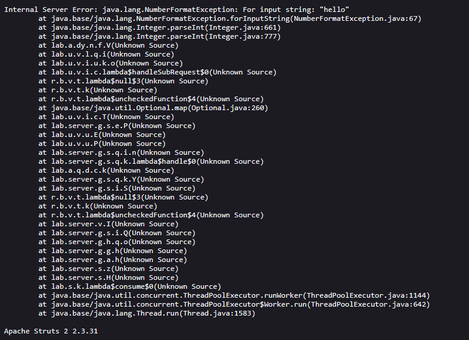

# Information disclosure in error messages
**Category:** Web Exploitation — Information disclosure
**Difficulty:** Apprentice
**Progress:** Solved

---

## Description

**Lab URL:** `https://portswigger.net/web-security/information-disclosure/exploiting/lab-infoleak-in-error-messages`

This lab's verbose error messages reveal that it is using a vulnerable version of a third-party framework. To solve the lab, obtain and submit the version number of this framework. 

---

## Reconnaissance

- What does the application do? 
    - The website is a shop. No account functionality
- Where is user input accepted? (forms, URL parameters, headers, cookies)
    - No user input except maybe the url
- What happens with normal input?
    - No normal user input

---

## Analysis

#### Vulnerability

Leaking a raw internal error (triggered by a type mismatch) instead of a generic error message is the vulnerability here.

---

## Solution 

### Step 1 - Recon / Looking at responses

No `/robots.txt` or `/sitemap.xml` . But when clicking on shop items the url changes to `https://0ad8008103b9260480a8777000d600c1.web-security-academy.net/product?productId=18`
`productID` changes depending on the item chosen.
Inputting a large not used ID does not reveal anything.
But inputting a string like "hello" returns an internal server Error:

The framework and version we are looking for is: `Apache Struts 2 2.3.31` which after submitting solves the lab

---
## Real World Impact

Information disclosure is rarely the goal but enables further attack. This appache version is old and there are publicly known exploits for it.

---
## Learnings

- forcing type mismatch errors can leak useful information
