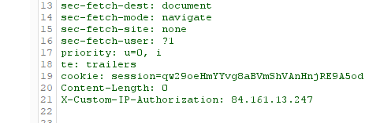

# Authentication bypass via information disclosure
**Category:** Web Exploitation — Information disclosure
**Difficulty:** Apprentice
**Progress:** Solved

---

## Description

**Lab URL:** `https://portswigger.net/web-security/information-disclosure/exploiting/lab-infoleak-authentication-bypass`

This lab's administration interface has an authentication bypass vulnerability, but it is impractical to exploit without knowledge of a custom HTTP header used by the front-end.
To solve the lab, obtain the header name then use it to bypass the lab's authentication. Access the admin interface and delete the user carlos.
You can log in to your own account using the following credentials: wiener:peter 

---

## Reconnaissance

- What does the application do? 
    - The website is a shop. User accounts are back
- Where is user input accepted? (forms, URL parameters, headers, cookies)
    - Input expected for the user login
- What happens with normal input?
    - Correct credentials log the user in, incorrect ones do not work.

---

## Analysis

#### Vulnerability

This is a misconfiguration. The developer left the `TRACE` method in the production environment on accident, leading to information disclosure.
Using a client-controlled header for authorization falls under broken access control.

---

## Solution 

### Step 1 - Recon / Looking at responses

No `/sitemap.xml` or `/robots.txt`. Changing the account id in the url to something not our own account gets us back to the login screen.
When accessin `/admin` the error message says: `Admin interface only available to local users ` which means we have to manipulate our IP shown to the server.
`X-Forwarded-For: 127.0.0.1` still returns a 401 Unauthorized response so a different header is needed.
The lab talks about custom HTTP headers. After trying different headers, it seems the correct one is `TRACE` which is designed for diagnostic purposes.
When trying to access `/admin` but with the changed `TRACE` Header there is something interesting:

---
### Step 2 - Enumeration / Exploitation

This is the needed header. Copying it to the request, setting it to `127.0.0.1` and changing `TRACE` back to `GET` returns a 200 response and gets us to the admin panel.
In the response we can see lines like: `<a href="/admin/delete?username=carlos">` which we are again unauthorized to use if not using the `X-Custom-IP-Authorization`-header.
Using it like this and as a result deleting carlos account solves the lab.

---
## Real World Impact

If a header like this is used for authorization the whole system collapses the moment it is known. It being unknown was the only defense - securiy by obscurity again.

---
## Learnings

- two headers to tell the server which IP we come from (`X-Forwarded-For` and `X-Custom-IP-Authorization`)
- Checking for other HTTP methods then `POST` and `GET` is important. Only `TRACE` revealed the actual working header
