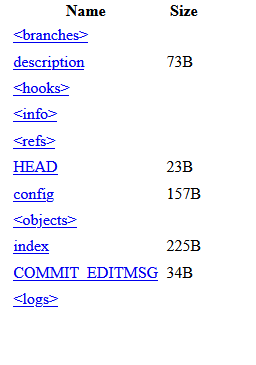
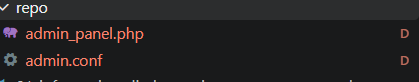
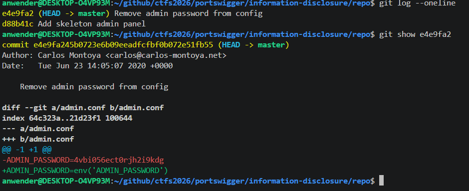

# Information disclosure in version control history
**Category:** Web Exploitation — Information disclosure
**Difficulty:** Apprentice
**Progress:** Solved

---

## Description

**Lab URL:** `https://portswigger.net/web-security/information-disclosure/exploiting/lab-infoleak-in-version-control-history`

This lab discloses sensitive information via its version control history. To solve the lab, obtain the password for the administrator user then log in and delete the user carlos

---

## Reconnaissance

- What does the application do? 
    - The website is a shop. User accounts are back
- Where is user input accepted? (forms, URL parameters, headers, cookies)
    - Input expected for the user login
- What happens with normal input?
    - Correct credentials log the user in, incorrect ones do not work.

---

## Analysis

#### Vulnerability

Websites often use some form of version control system like Git. By default Git stores version control data in .git and this was exposed herein the production environment. The dev even deleted the password but since this is a version control system it was easy to go back to an earlier stage and find the actual password.

---

## Solution 

### Step 1 - Recon / Looking at responses

No `/sitemap.xml` or `/robots.txt`. The lab talks about version control so let's try `/.git`
This returns a full file structure:

Using `wget -r https://0aa600c40494753180a87bb000390063.web-security-academy.net/.git` downloads all the files recursively. Or so I thought, apparently it does not work because git's internal files are not linked so wget can't grab them.
The tool git-dumper helps here. Using `git-dumper https://0aa600c40494753180a87bb000390063.web-security-academy.net/.git ./repo` we can see two files:

`admin.conf` is a one line file reading: `ADMIN_PASSWORD=env('ADMIN_PASSWORD')`. Since in `admin_panel.php` it says: `<?php echo 'TODO: build an amazing admin panel, but remember to check the password!'; ?>` this seems like the changed version so maybe there is the real password in an earlier version?

---
### Step 2 - Enumeration / Exploitation

To exploit this, we need to use some git commands, because these two files are shown as deleted (`D` in the screenshot)

`git log --oneline` lists the commit history line by line. Here it shows two commits. The former being the interesting one, since it apparently is about removing the admin password from the config.
`got show e4e9fa2` now shows exactly that commit and lists the changes at the end. So the "removed" password is: `4vbi056ect0rjh2i9kdg`
which can be used to login as administrator and delete carlos.

---
## Real World Impact

An exposed .git in the wild often means the entire projects source tree and structure is leaked. This includes past versions which might give an attacker more info about current versions as well. Removing a secret in a version control system does only delete it form the current and future version but it is still viewable in past versions. The only way to secure this is by changing the secret, purge the history and stop `.git` from being exposed.

---
## Learnings

- wget does not work for exposed `.git` directories, but git-dumper works
- deleting stuff in a version control system does not mean it is not viewable
- For defenders: Never ship `.git` to a production environment
