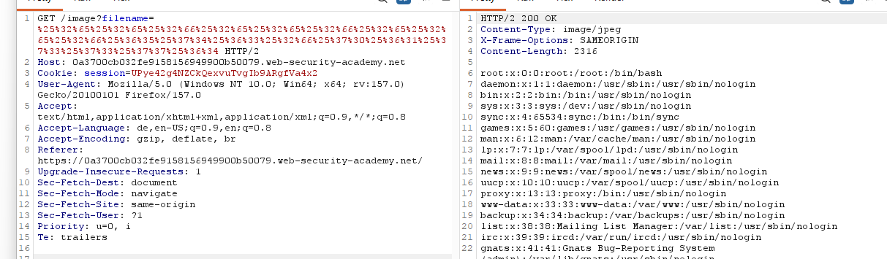

# File path traversal, traversal sequences stripped with superfluous URL-decode
**Category:** Web Exploitation — Path traversal
**Difficulty:** Practicioner
**Progress:** Solved

---

## Description

**Lab URL:** `https://portswigger.net/web-security/file-path-traversal/lab-superfluous-url-decode`

This lab contains a path traversal vulnerability in the display of product images.
The application blocks input containing path traversal sequences. It then performs a URL-decode of the input before using it.
To solve the lab, retrieve the contents of the /etc/passwd file. 

---

## Reconnaissance

- What does the application do? 
    - The website is a shop. 
- Where is user input accepted? (forms, URL parameters, headers, cookies)
    - No input anywhere
- What happens with normal input?
    - No input anywhere

---

## Analysis

#### Vulnerability

The application first decodes the parameters and then strips `../` and decodes again. This means inputting a raw path traversal does not work since  `../` is stripped. And onetime url-encoding just means it will be decoded, showing the path traversal and then stripped. Encoding twice will let the path-traversal attack surivive the decoding.

---

## Solution 

### Step 1 - Recon / Looking at responses

This time the lab talks about URL-decoding the input before using it, so simply encoding it by rightclicking and choosing url-encoding for the changed header should work.

---
### Step 2 - Enumeration / Exploitation

Single url-encoded did not work. The response changed from `No such file` to `Not found` 
Double url-encoded works:

---
## Real World Impact

This vulnerability lets any user access any readable file, like passwd or config files. An attacker using this could get database access, find leaked credentials or escalate his privileges.

---
## Learnings

- double url-encode works vs decode-strip-decode filter
- encoding only works if the decode happens after the strips