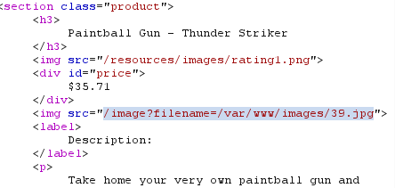

# File path traversal, validation of start of path
**Category:** Web Exploitation — Path traversal
**Difficulty:** Practicioner
**Progress:** Solved

---

## Description

**Lab URL:** `https://portswigger.net/web-security/file-path-traversal/lab-validate-start-of-path`

This lab contains a path traversal vulnerability in the display of product images.
The application transmits the full file path via a request parameter, and validates that the supplied path starts with the expected folder.
To solve the lab, retrieve the contents of the /etc/passwd file. 

---

## Reconnaissance

- What does the application do? 
    - The website is a shop. 
- Where is user input accepted? (forms, URL parameters, headers, cookies)
    - No input anywhere
- What happens with normal input?
    - No input anywhere

---

## Analysis

#### Vulnerability

This time the application just checks the start start of the input (`var/www/images`). Unfortunately the app does not validate where the path is resolved

---

## Solution 

### Step 1 - Recon / Looking at responses

This time the program apparently only reads from a full path:

---
### Step 2 - Enumeration / Exploitation

So the headers needs to be changed accordingly from `GET /product?productId=4 HTTP/2` to `GET /image?filename=/var/www/images/../../../etc/passwd HTTP/2`
and it works - the response shows the passwd file again.

---
## Real World Impact

This vulnerability lets any user access any readable file, like passwd or config files. An attacker using this could get database access, find leaked credentials or escalate his privileges.

---
## Learnings

- a start-of-string check is not a destination check
