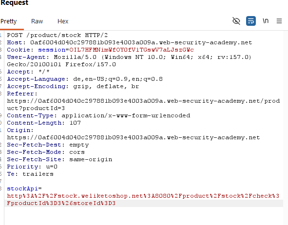

# Basic SSRF against the local server
**Category:** Web Exploitation — SSRF
**Difficulty:** Apprentice
**Progress:** Solved

---

## Description

**Lab URL:** `https://portswigger.net/web-security/ssrf/lab-basic-ssrf-against-localhost`

This lab has a stock check feature which fetches data from an internal system.
To solve the lab, change the stock check URL to access the admin interface at http://localhost/admin and delete the user carlos. 

---

## Reconnaissance

- What does the application do? 
    - The website is a shop. There is a stock-check feature
- Where is user input accepted? (forms, URL parameters, headers, cookies)
    - No direct user input, only in the request itself
- What happens with normal input?
    - The stock of an item at a certain location is given back

---

## Analysis

#### Vulnerability

The app takes an url from user input (stockApi) and fetches it server-side. Changing the url to `localhost/admin` works because the admin panle trusts requests that originate from the internal network/localhost. E.g If you come from the localhost you are a trusted admin.

---

## Solution 

### Step 1 - Recon / Looking at responses

Using the stock feature we can see the following type of request:

After decoding the encoded line it says `stockApi=http://stock.weliketoshop.net:8080/product/stock/check?productId=3&storeId=3`
Now replacing that url with the url we think belongs to the admin panel: `stockApi=http://localhost/admin&storeId=3`
And indeed it shows an admin panel. Pressing on carlos name doesn't work since we lack the admin permissions but we can still use the url used to delete carlos account: `/admin/delete?username=carlos`

---
### Step 2 - Enumeration / Exploitation

To actually delete carlos account we just need to put that url into the stockApi paramter: `stockApi=http://localhost/admin/delete?username=carlos&storeId=3`
and the lab is solved.

---
## Real World Impact

Abusing this vulnerability an attacker can reach internal services (admin panels, databases) and in the process steal credentials or API-Keys. 
He could also map the internal server using the server as a proxy.

---
## Learnings

- internal services tend to trust localhost/internal sources. 
- any parameter holding a url that gets fetched server-side could be vulnerable.
