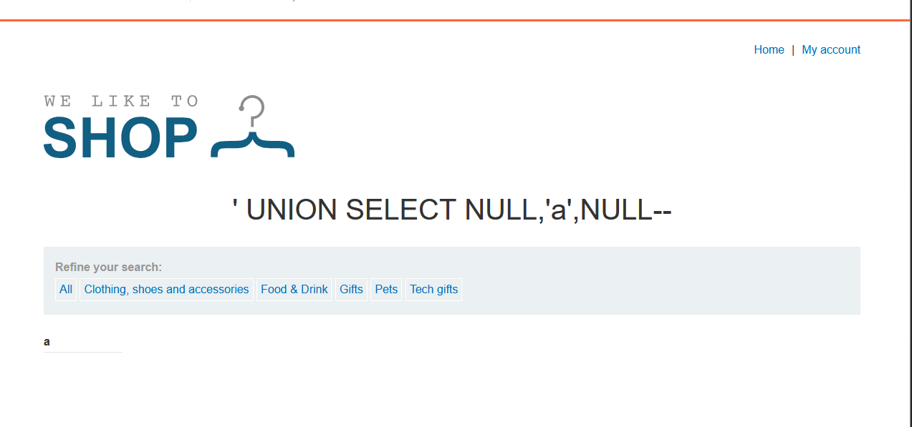

# SQL injection UNION attack, finding a column containing text

**Category:** Web Exploitation — SQL Injection  
**Difficulty:** Practitioner
**Progress:** Solved

---

## Description

**Lab URL:** `https://portswigger.net/web-security/sql-injection/union-attacks/lab-find-column-containing-text`


 This lab contains a SQL injection vulnerability in the product category filter. The results from the query are returned in the application's response, so you can use a UNION attack to retrieve data from other tables. To construct such an attack, you first need to determine the number of columns returned by the query. You can do this using a technique you learned in a previous lab. The next step is to identify a column that is compatible with string data.

The lab will provide a random value that you need to make appear within the query results. To solve the lab, perform a SQL injection UNION attack that returns an additional row containing the value provided. This technique helps you determine which columns are compatible with string data. 


---

## Reconnaissance

- What does the application do? 
    - A website that shows items, their prices and details. Users can search by categories and their is an account functionality
- Where is user input accepted? (forms, URL parameters, headers, cookies)
    - there is no input field (except for the account login) but the user can input text into the url
- What happens with normal input?
    - inputting a normal word instead of the given categories prints the word on the page and shows no results, inputting the given categories works like it should

---

## Analysis

#### Technology Stack
```
Database:   Can't be sure of the underlying database
Input:      URL
Behavior:   union based sql injection
```

#### Vulnerability

- What exactly is vulnerable and why?
    
As per the lab instructions the category filter is vulnerable. 
It probably looks like this:
```sql
SELECT * FROM products WHERE category = '[input]'
```
To use an actual UNION attack we need to first find out how many columns are returned by this query. As per last lab it is 3. Now we need to find out which column returns a string so we can exploit it.

---

## Solution

### Step 1 - Craft payload

To find out which column returns a string we simply replace each Null with a character one by one.
```sql
category=' UNION SELECT 'a',NULL, NULL--
```
```sql
category=' UNION SELECT NULL, 'a', NULL--
``` 
etc.
This second example already works. 



---
### Step 2 - Extract / Exploit


Since the second column is the one that is vulnerable by being of str-type and the random value that is to be extracted is: `Ca9eTC` (I took way too long to find this) the payload has to look like this:

```sql
category=' UNION SELECT Null, 'Ca9eTC', Null--
```
This solves the lab.
---

## Real World Impact

This goes one step further than the last lab. An Attacker using this technique is able to extract data from a database not originally used which could save anything. It could be user data, product data or financial data that an attacker can easily read using this technique.

---

## Learnings

- The random value was right on top of the website. 
- Finding string columns is done by enumerating, NULL is used as a placeholder since it is convertible to every data type