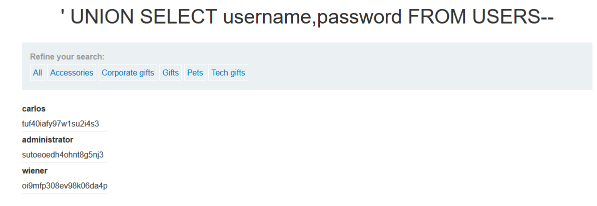

# SQL injection UNION attack, retrieving data from other tables

**Category:** Web Exploitation — SQL Injection  
**Difficulty:** Practitioner
**Progress:** Solved

---

## Description

**Lab URL:** `https://portswigger.net/web-security/sql-injection/union-attacks/lab-retrieve-data-from-other-tables`


 This lab contains a SQL injection vulnerability in the product category filter. The results from the query are returned in the application's response, so you can use a UNION attack to retrieve data from other tables. To construct such an attack, you need to combine some of the techniques you learned in previous labs.

The database contains a different table called users, with columns called username and password.

To solve the lab, perform a SQL injection UNION attack that retrieves all usernames and passwords, and use the information to log in as the administrator user. 


---

## Reconnaissance

- What does the application do? 
    - Website looks a little different, has more text now. But same window for refining the search and same login form
- Where is user input accepted? (forms, URL parameters, headers, cookies)
    - there is no input field (except for the account login) but the user can input text into the url
- What happens with normal input?
    - inputting a normal word instead of the given categories prints the word on the page and shows no results, inputting the given categories works like it should

---

## Analysis

#### Technology Stack
```
Database:   Can't be sure of the underlying database
Input:      URL
Behavior:   union based sql injection
```

#### Vulnerability

- What exactly is vulnerable and why?
    
As per the lab instructions the category filter is vulnerable. 
It probably looks like this:
```sql
SELECT * FROM products WHERE category = '[input]'
```
To use an actual UNION attack we need to first find out how many columns are returned by this query. Then we need to check which columns contain a string. If there are two strings right after each other we can select username and password from the user table.

---

## Solution

### Step 1 - Craft payload
Since typing all of that into the url and waiting for the website to load using the inbuilt repeater function of burp suite is a must here. 

To find the number of columns we can use the GROUP BY method.
```sql
category=' GROUP BY 2--
```
is the last one that does not throw an error.
Now check for the strings.
```sql
category=' UNION SELECT 'a', 'a'--
``` 
works.

---
### Step 2 - Extract / Exploit

So now we know there are two coloumns, both containing strings. We also know the users table contains usernames and passwords (both strings) so we can exploit it now.

```sql
category=' UNION SELECT username, password from users--
```
Returns the following accounts:

---

## Real World Impact

This is a fully fledged out UNION attack now. And even though the lab told us about the users table this is nothing that is out of the ordinary. If this attack is allowed to happen in the wold it could potentially disclose millions of users login credentials.
---

## Learnings

- Going step by step (first finding the amount of columns then the strings etc.) is important and makes things easier
- Burp Suites built in 'repeater' makes quickly adjusting the http request easy making the whole process quicker.